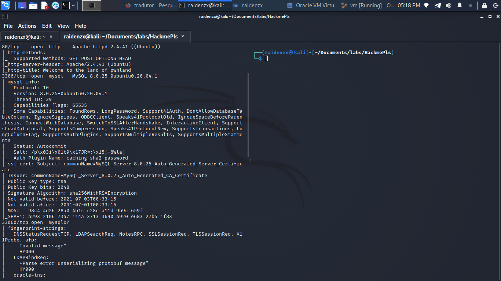
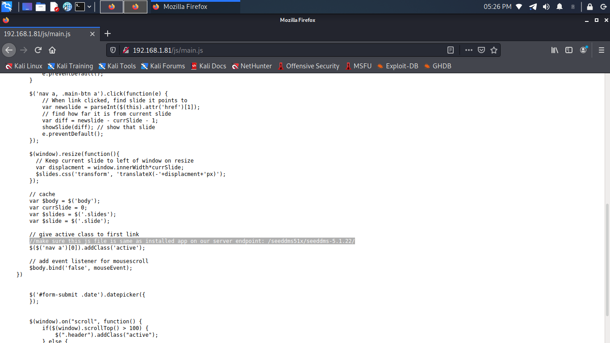

    	Machine Name

​		DDth Month YYYY

​		Machine Author(s): `RaidenZX`

​		

 

### Description:

This machine...  I am bringing for many people to learn beyond web exploration
happy hacking!!!

### Difficulty:

`easy`

### Flags:

User: `saket:e51762be19cf67d78cf7806a6ad3a123`

Root: `root:5375627363726962654f6e4d79436861`

# Enumeration

in the enumeration phase we can use nmap even to see which ports are initially open

    	Machine Name

looking for the source view i didn't find anything so giving a gobuster i noticed an open js/ so i came across the CMS version...

    	Machine Name

but of course I also looked a little bit about the source-forge version and i found this...

    	Machine Name

and stay here...

    	Machine Name

# Foothold
I logged in with the credentials in mysql and...

    	Machine Name

and I found a CVE for this CMS.

    	CVE

# Lateral Movement

# Privilege Escalation

