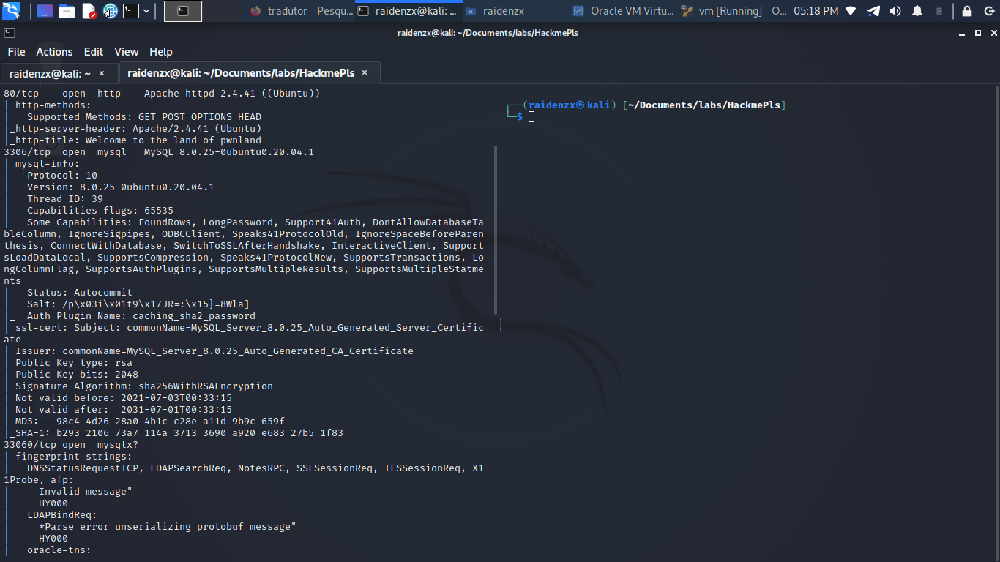
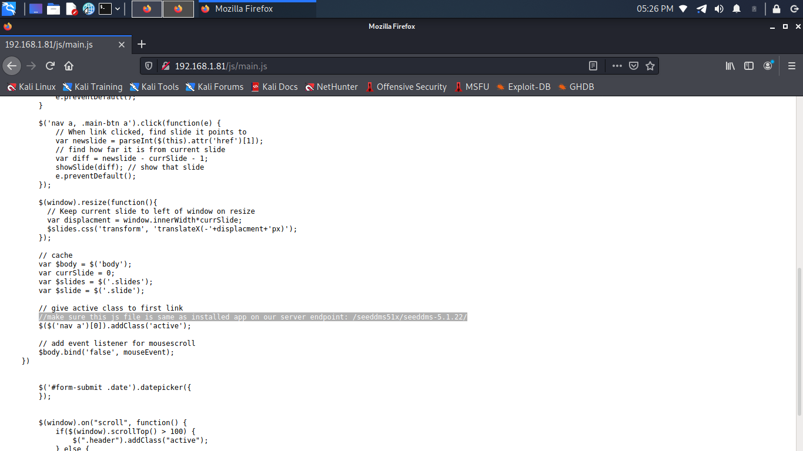
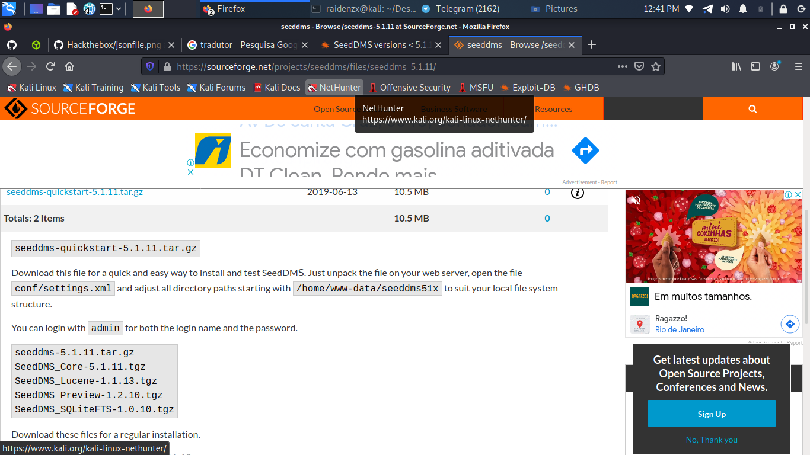
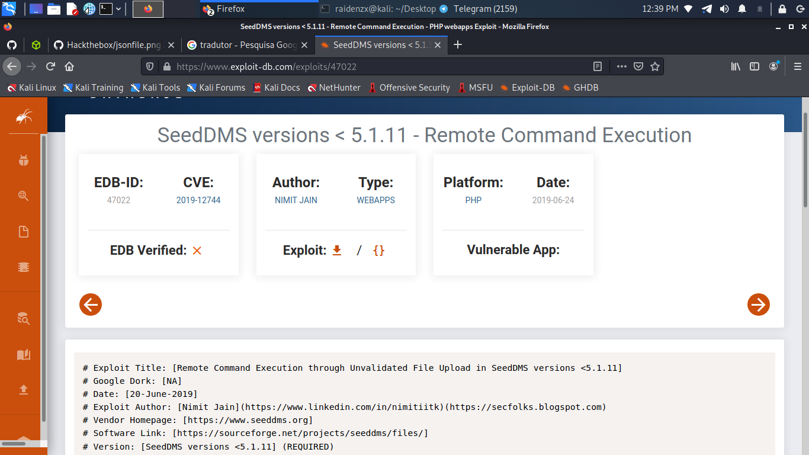
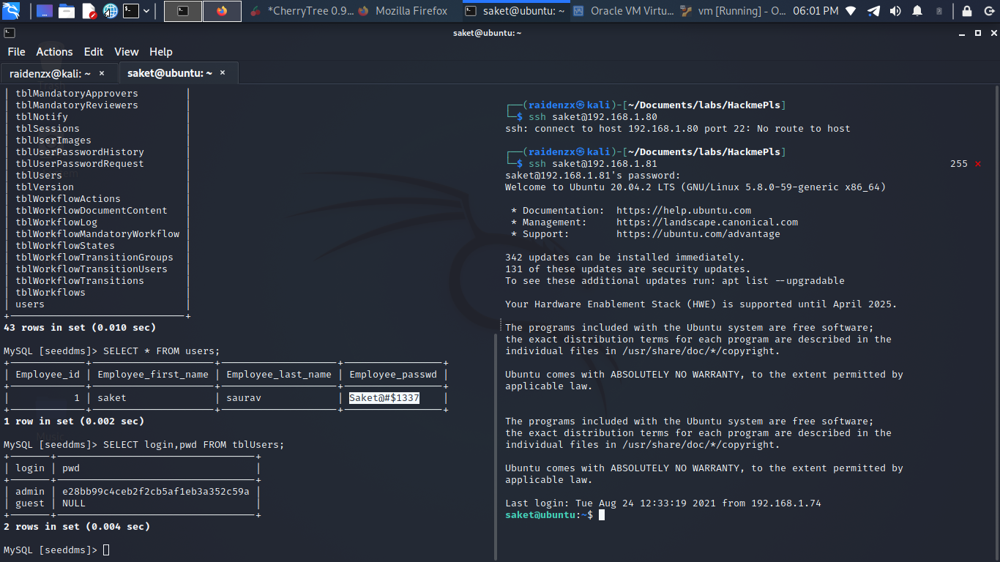
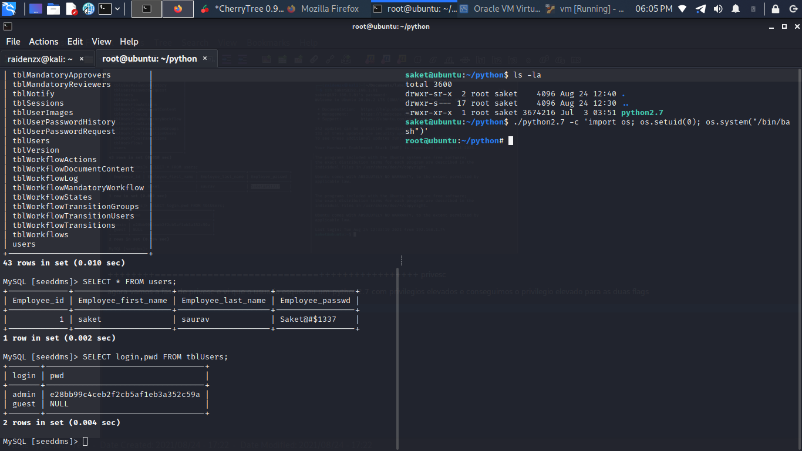

    	Seed

​		DD:25 th August Month 2021

​		Machine Author(s): `RaidenZX`

​		

 

### Description:

This machine...  I am bringing for many people to learn beyond web exploration
happy hacking!!!

### Difficulty:

`Easy`

### Flags:

User: `saket:e51762be19cf67d78cf7806a6ad3a123`

Root: `root:5375627363726962654f6e4d79436861`

# Enumeration

in the enumeration phase we can use nmap even to see which ports are initially open

 
    

 
looking for the source view i didn't find anything so giving a gobuster i noticed an open js/ so i came across the CMS version...

 
   

 
but of course I also looked a little bit about the source-forge version and i found this...

 
    

 
and stay here...

 
 

 
and I found a CVE for this CMS.

 

# Foothold

I logged in with the credentials in mysql and...

 
 

 
and i tested the login with saket user on ssh and it worked!

 
 

# Privilege Escalation

i saw a python 2.7 executable with privileged permissions i tried to sudo but it didn't work... but using my basic python skills i got root

 
 

